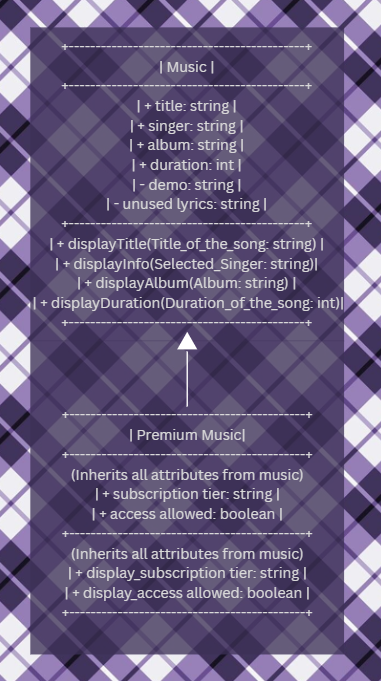
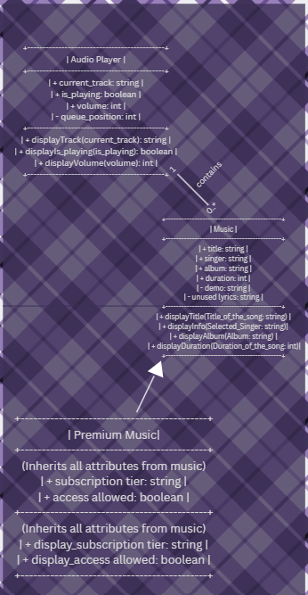
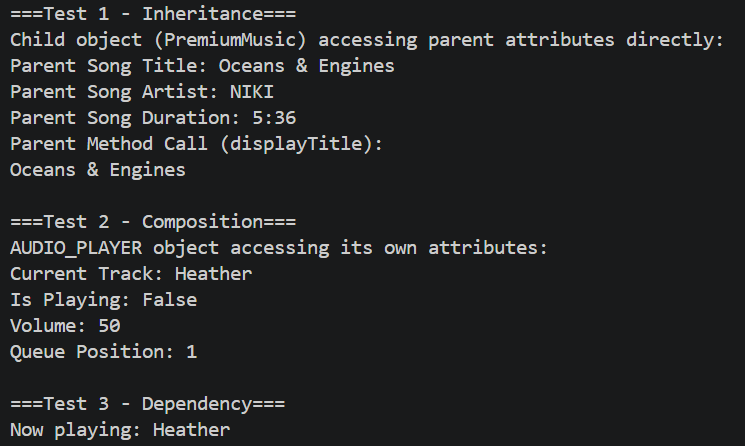
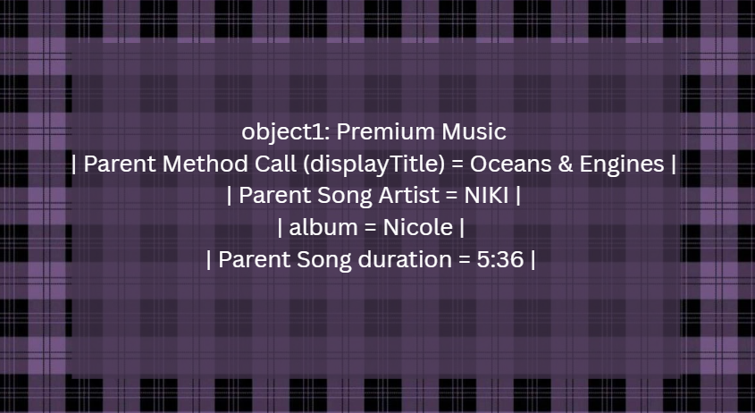

# Advanced Class Relationships
## Previous Activities
[classAttrib](classAttributesMethods.md)
[classRel](classRelationships.md)
## Existing System Description:
Class 1: Music
Class 2: Audio Player

# What problem or limitation exists in your current design?
A constraint in my existing design is the undirectional visibility between the audio player and music classes. while the player manages and executes the music objects, the music class remains entirely unaware of the player context. this one-way relationship makes it difficult for a track to know its own playback state, such as whether it is currently playing or paused, forcing the audio player to exclusively manage all state data

## Inheritance Relationship
Parent: Music
Child: Premium Music
Explanation: The parent class music defines standard attributes like title, artist, and duration for general audio tracks. the child class premium music inherits all these core properties but extends functionality to include preview restrictions and access validations, acting as  aspecialized type of music track requiring an active subscription asset profile.
## Inheritance UML

## Composition/Aggregation
Relationship: Aggregation
Explanation: The relatoinship between audioplayer and music is an aggregation because it represents a weak "HAS-A" architectural binding. the audioplayer stores, references, and queues the tracks inside a playlist array, but the track objects are created independently and can continue to exist within memory even if the player instance itself is deleted
## Advanced UML Diagram

## Python Implementation
[Source Code](advancedRelationships.py)
## Test Run

## Object Diagram

## Reflection
### Why did you choose your inheritance relationship? Explain why your child class is a type of your parent class.
i chose this relationship because a premium song is still a song at its core. it needs the same basic details like a titile, atrist, and duration, but it just adds subscription rules. therefore, premium music is a specific type of music. this setup perfectly matches how real streaming apps seperate free and pain tracks
### How did inheritance reduce duplicate code? Identify attributes or methods that were reused.
inheritance stopped me from writing the same code twice fot the title, artist, and duration variables. the child class automatically gets reused the parent's string print method by calling super()._str_(). this saved space and kept the code clean
### Why is your HAS-A relationship Composition or Aggregation? Explain the lifecycle relationship between the two objects.
the relationship is aggregation because songs can exist without the music player. a track is an independent file that stays saved in memory even if the player application is closed or deleted. the player simple holds a list of these tracks to play them. since the tracks can live on without the player, it is a weak relationship
### What is the difference between Association from Part III and the advanced relationship you implemented?
a basic association is just a loose link where two objects talk to each other as equals. the advanced aggregation relationshio I used creates a clear hierarchy. it shows that the audioplayer is a container that organizes and controls a list of songs. this makes the code structure more proffesional and organized
### How does your design follow the DRY principle?
my design followews the dry principle by keeping all common song variables in one parent class. if i want to add a basic feature to all songs later, I only have to chance it in that one spot. I do not need to copy and paste changes into multiple class files. this creates a single source of truth for the system