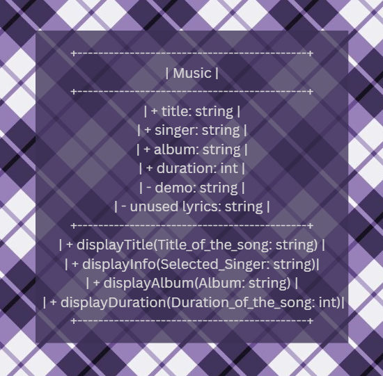
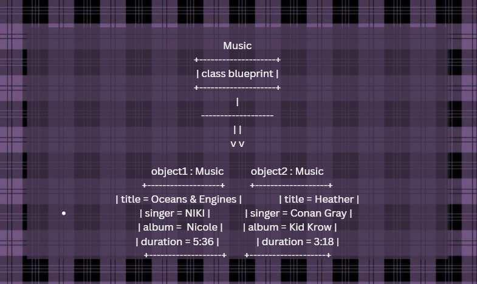

# Class Attributes and Methods
## Previous Design
Link to my previous activity:
[classObjectUML.md](classObjectUML.md)
## Design Revision
Describe any changes made to your original class.
## Visibility Decisions
| Attribute | Data Type | Visibility | Reason |
|---|---|---|---|
| title | string | public | So that people know what to look up to find the song |
| singer | string | public | So that people know who sang the song |
| album | string | public | So that people know where the song is featured |
| duration | int | public | So that the people know how long the song is |
| demo | string | private | The demo should be private because it ay contain unreleased lyrics and music that may spark reactions from others |
| unused lyrics | string | private | The unused lyrics should be private because those lyrics may cause unexpected reactions from others |
## Updated UML Class Diagram

## Python Implementation
[View Python Source](classImplementation.py)
## Test Run

## Object Diagram

## Analysis
### Why did you make your chosen attribute private?
So that leaks can be prevented, protect unfinished work, and keep a control over the public image.
### Which method changes the state of your object?
The update number of streaks, because instead of displaying it, youre changing the value of the attribute
### How did your two objects demonstrate that instances are independent?
When i altered the number of streams for 1 object, the number of streams for the other object would not change. this proves that objects are independent from each other
### What is the difference between your class diagram and your object diagram?
The class is like the blueprint as it carries the attributes and methods without any value and the object diagaram is just the same as the class diagram but it has values