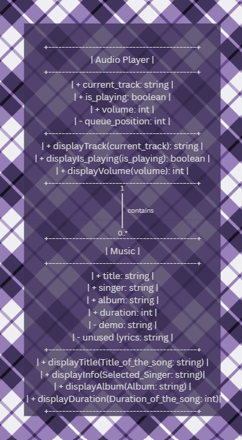
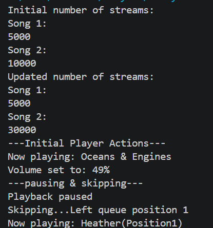
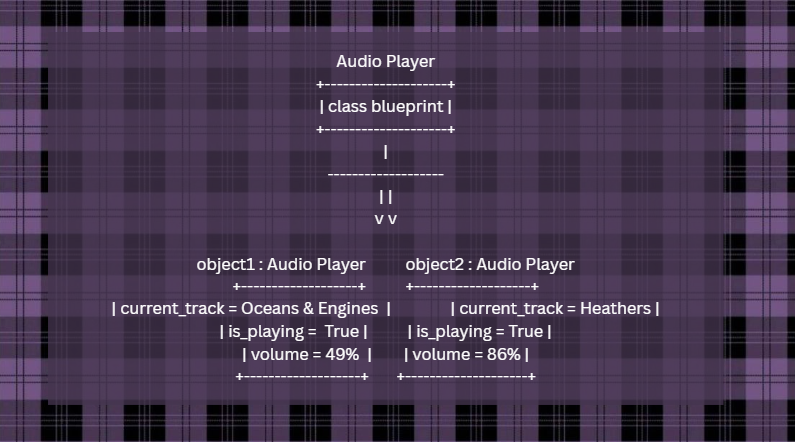

# Class Relationships: Association and Multiplicity
## Previous Work
[Part I - Classes and Objects](classObjectUML.md)

[Part II - Class Attributes and Methods](classAttributesMethods.md)
## Existing Class
Class: Music

Description: The class shows the different albums
## New Related Class
Class: Audio Player

Description: The class is like the core engine of any music application
## Association
Relationship: Audio Player controls the songs 

Explanation: Audio player is needed because without it, the songs are just there. You need it because without it you wont be able to play it
## Multiplicity
Multiplicity: one to many : Audio_Player ───────── Music

Explanation: One audio player plays many songs. The application remains organized and lightweight
## UML Class Relationship Diagram

## Python Implementation
[View Python Source](classRelationships.py)
## Test Run

## Object Relationship Diagram

## Analysis
### What is the association between your two classes?
The song acts like a storage that holds the musical data and the audio player is like the engine that takes the data as input and plays the song
### What multiplicity did you choose and why?
I chose one to many because one audio player plays many different tracks. Due to the audio player the application remains organized and lightweight
### How did you implement the relationship in Python?
I implemented the relationship in python by storing a list
### Why did you store an object reference instead of copying its data?
I stored an object reference rather than copying its data because object reference is better for storage, its more efficient, and its performance is better than just copying its data.
### If your relationship uses many, why is a list appropriate?
<<<<<<< HEAD
A list is appropriate so that it will stay organized and lightweight.
=======
    A list is appropriate so that it will stay organized and lightweight.

LLM used: -> Built-in Gemini feature when searching in Google
>>>>>>> c814a3e113441ee98ab59409a349b9aad3fb9a59
